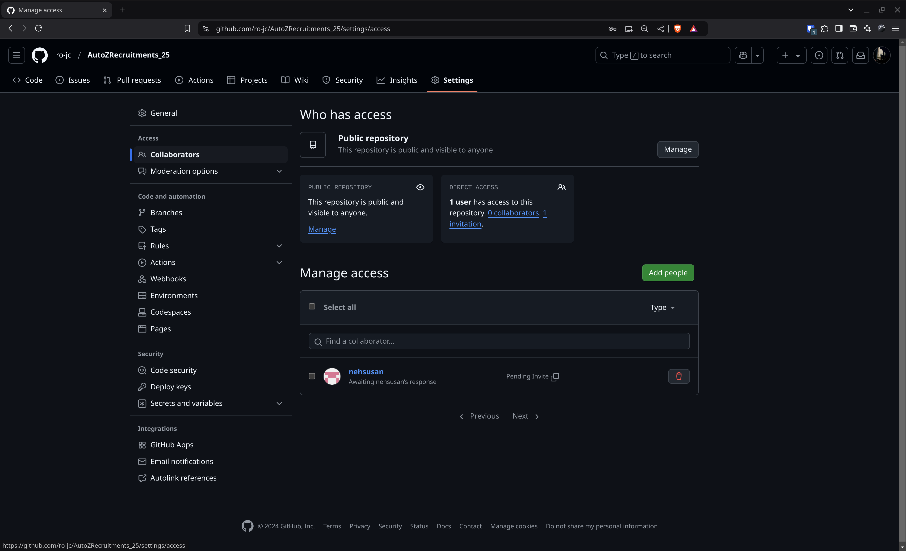

# Autonomy / CS Tasks

> Welcome the Autonomy domain - the brains of robotic systems

## Tasks

Each of the markdown files in this directory contains a task and they are listed in fairly ascending order of difficulty.
We have attempted to gradually ramp up the difficulty but do not be disheartened if you get stuck at some point - stick with it.

These tasks probably deal with a lot of material that most of you may not be familiar with as they aren't tools you usually encounter as part of your academic course unless you have a personal interest in robotics. Which is to say, we don't expect that you know how to solve them right off the bat.

## Expectations

What we are looking for are dynamic problem solvers who have the persistence, patience and passion to spend the time to understand the problem, learn the tools and apply them in clever ways efficiently.

Hence, you are very much encouraged to go online and find whatever resources you can to learn about everything that you encounter along the way. There are plenty of resources that can point you to the answer and since most of the software is open source, nothing's stopping you from taking a peek under the hood either :P

If you feel you've given it your best, feel free to approach us and show us what you've done so far and we may be able to give you a nudge.

## LLMs

With regards to LLMs, we suggest you proceed with some more caution. It can be very efficient to use when learning something, with the caveat that not everything you get out of it may be right. This is however starting to be a smaller and smaller risk as they get better.

When solving the tasks however, we do not recommend that you use LLMs to write the code for you or handhold you through the process of solving the problem (even if you think you'll just understand the code later). While this may help you get to **some** answer quickly, the more complex a problem gets, the more tedious the process becomes. Besides, you miss out on **most** of the learning when you have the answer handed to you rather than working through the issues yoruself.

Once you have the core concepts down pat and are quite confident that you can write the code yourself, only then is it a good idea to use LLMs to write the code for you - when you can give it the exact steps you want it to follow and can judge the quality of code and approach that it produces.

## Submission

For submitting the tasks, you will be required to create a **private** Github repository and add **@ro-jc** and **@nehsusan** as collaborators so that we can see your submissions. The link to your github repo should be submitted in the [google form](https://docs.google.com/forms/d/e/1FAIpQLSdSybOp2FBCiA8M_ji3fmfN77aiFV3J6-CucTQOy-h3Z3Hjzg/viewform?usp=sf_link) for task submissions.

When setting up the repo, keep the following guidelines in mind:

- Try to confine each task to its own package and name those appropriately
- You may initialize your git repository in the root folder of your ROS workspace
- Only commit the necessary files (directories in ws/src) - avoid committing everything in your workspace
- Make use of the `.gitignore` file to ensure that the `build/`, `install/` and `log/` directories and any other packages you clone that aren't written by you are ignored by git

You can follow the instructions in the below links if you find yourself needing help in the process:

[How to setup SSH in GitHub by example](https://www.theserverside.com/blog/Coffee-Talk-Java-News-Stories-and-Opinions/GitHub-SSH-Key-Setup-Config-Ubuntu-Linux)

[Setting up a repository](https://www.atlassian.com/git/tutorials/setting-up-a-repository)

The option to add collaborators can be found in the settings page of your github repo:

