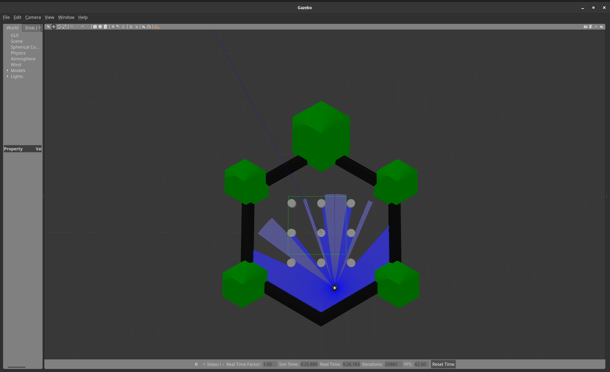

# TurtleBot3 Obstacle Avoidance

## What you’ll learn:

- Using gazebo for simulation
- Working with turtlebot3
- Taking input from sensors

## Task

The objective of this task is to write a ROS node to run turtlebot3 in the turtlebot3_world in gazebo while avoiding
any obstacles or walls that come up in its path. Simple obstacle avoidance by turning in the opposite direction will do.

## Deliverables

1. The ROS package that contains your node and any other external files you've created (only the particular folder
   within the `src/` directory in your workspace)
1. A short, simple screencast that shows your simulation. A video shot externally works too if you have trouble with
   screen recording ([OBS](https://obsproject.com/) may help: `sudo apt install obs-studio`).

## Resources

Ensure that you have gazebo installed and working (try typing `gazebo` into the terminal)

The instructions on [this page](https://emanual.robotis.com/docs/en/platform/turtlebot3/simulation/#gazebo-simulation)
(**ensure you have `Humble` selected at the top**) should give you all that you need in order to get up and running with
launching a simulation with the turtlebot3 int the turtlebot3 world as shown:

