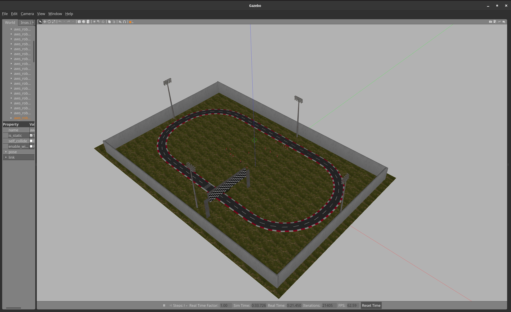

# Turtlebot3 Lane Detection and following

## What you'll learn:

- Editing an SDF file
- Basic image processing

## Task

The objective of this task is to run the turtlebot3 for one lap in the aws racetrack world within the lanes.

You will have to:

1. Clone the **ros2** branch of the [racetrack world](https://github.com/aws-robotics/aws-robomaker-racetrack-world/tree/ros2) into your `workspace/src` (treat the folder as a normal ros package) or switch to the **ros2** branch (from within the aws-robomaker-racetrack-world directory, run `git checkout ros2`) after cloning normally. Build the package.
1. Try to launch the racetrack world alone (you'll need to use the `racetrack.launch.py` file) with the parameters `mode:=day_empty` and `gui:=true`
1. Read the [README](https://github.com/aws-robotics/aws-robomaker-racetrack-world/blob/ros2/README.md) and figure out how to launch the aws world with turtlebot3 in it (use TURTLEBOT3_MODEL=waffle or waffle_pi as only those have cameras) anywhere close to the start/finish line (you'll have to modify the turtlebot3 launch file so that it calls the AWS world one too)
1. Write a node to get the camera data from the turtlebot3 and find out where the lanes are (use the fact that their colours are known beforehand)
1. Determine what `/cmd_vel` should be given to the turtlebot3 to make sure that it stays within the lanes (you can use the slope of the lanes or attempt to keep the bot centered)

The empty world:

The world with turtlebot3:

### Hints:

You may find that the **FOV** of the camera on the turtlebot or the camera height/angle are not the best to see both lanes simultaneously. You **are** allowed to change these (or any other) parameters as you wish in order to complete this task. This will however, require some digging around.

Look into editing the `model.sdf` file of the particular turtlebot3 model that you are using. The linux commandline tool `grep` may be of help. Make sure you rebuild your packages after every change.

## Deliverables

1. The ROS package that contains your node and any other external files you've created (only the particular folder within the `src/` directory in your workspace).
1. A PDF with a brief writeup on what approach you landed on to solve the problem and how you reached there. Also include a list of all external libraries you decided to use.
1. A short, simple screencast that shows your simulation running an entire lap or whatever you were able to accomplish. A video shot externally works too if you have trouble with screen recording ([OBS](https://obsproject.com/) may help: `sudo apt install obs-studio`).

## Resources

- [AWS Racetrack World](https://github.com/aws-robotics/aws-robomaker-racetrack-world/tree/ros2)
- [Turtlebot3 Simulation](https://github.com/ROBOTIS-GIT/turtlebot3_simulations)
- [Gazebo SDF File Tutorial](https://classic.gazebosim.org/tutorials?tut=build_model) and the next few in that series will be extremely useful to help you find your way around the turtlebot3 SDF file
- [OpenCV Colorspaces](https://docs.opencv.org/4.x/df/d9d/tutorial_py_colorspaces.html)
- [Edge detection and processing using Canny edge detector and Hough transform](https://wttech.blog/blog/2022/edge-detection-and-processing-using-canny-edge-detector-and-hough-transform/)
- [OpenCV Hough Line Transform](https://docs.opencv.org/3.4/d9/db0/tutorial_hough_lines.html)
